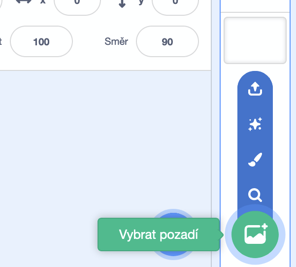
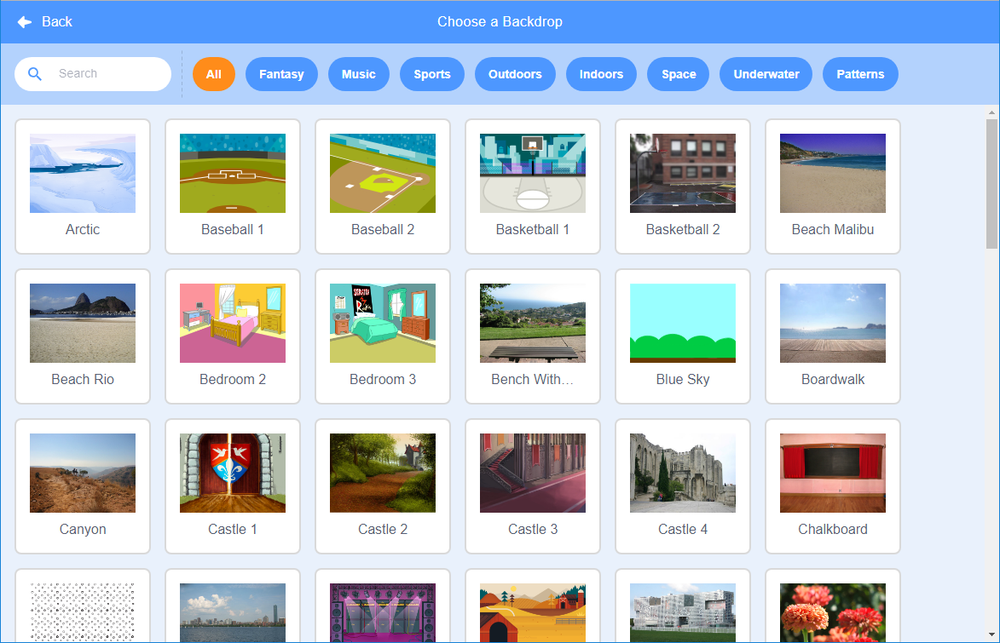

Kliknutím na **Vybrat pozadí** v pravém dolním rohu obrazovky otevřete výběr všech pozadí:

Můžeš vyhledat pozadí, nebo si jedno vybrat podle kategorie. Do projektu přidáš pozadí tím, že na něj klikneš.

