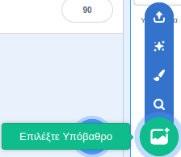
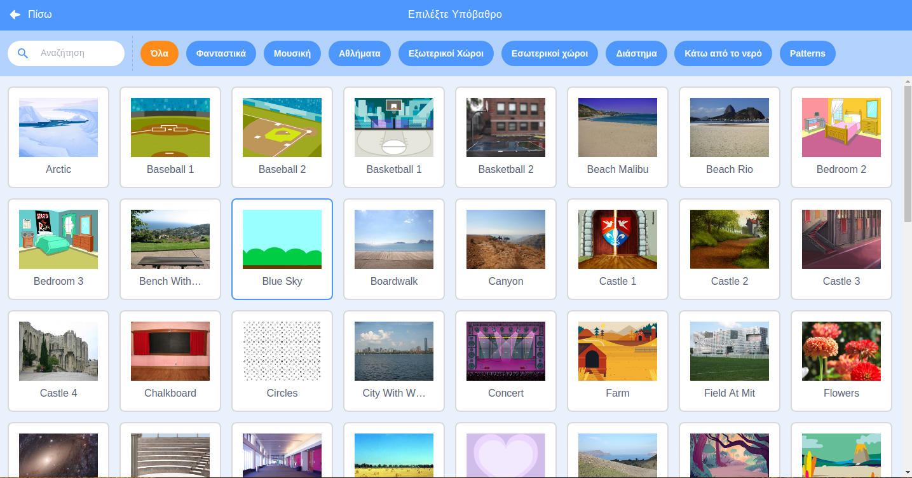

Κάνε κλικ στο **Επιλέξτε Υπόβαθρο** στην κάτω δεξιά γωνία της οθόνης για να ανοίξεις τη βιβλιοθήκη σκηνής:

Μπορείς να ψάξεις για ένα υπόβαθρο ή να αναζητήσεις ένα ανά κατηγορία. Κάνε κλικ σε ένα υπόβαθρο για να το προσθέσεις στο έργο σου.

