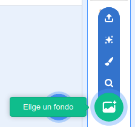
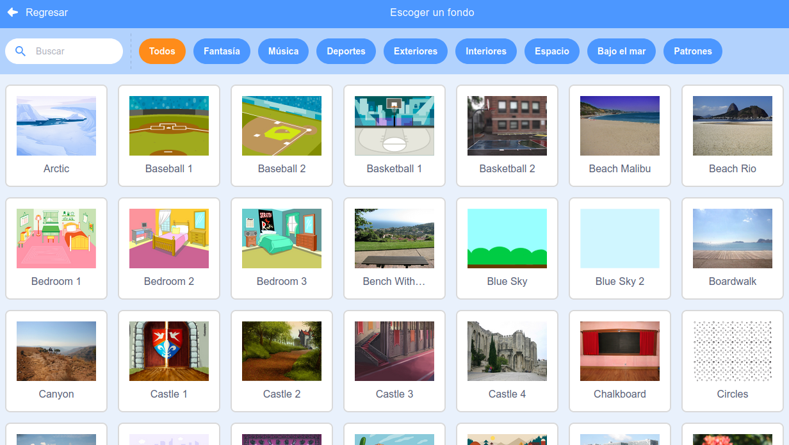

Haz clic en **Elige un fondo** en la parte inferior derecha para abrir la Biblioteca de Fondos:

Puedes buscar un fondo o explorar por categoría o tema para encontrarlo. Haz clic en un fondo para agregarlo a tu proyecto.

