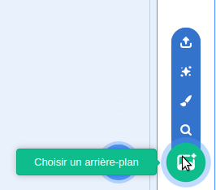
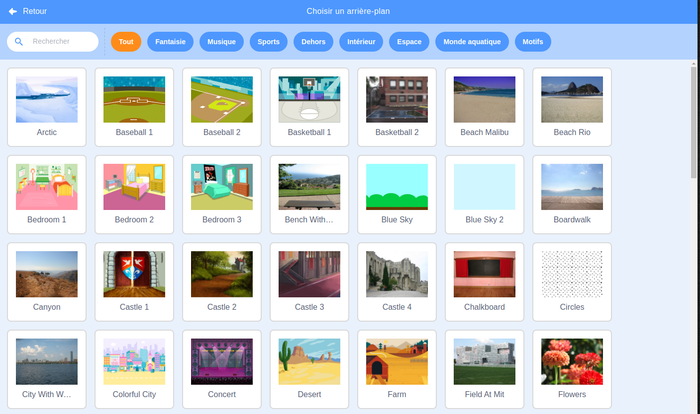

Clique sur **Choisir un arrière-plan** dans le coin inférieur droit de la fenêtre pour ouvrir la galerie des arrière-plans :

Tu peux rechercher un arrière-plan, ou les parcourir par catégorie. Clique sur un arrière-plan pour l'ajouter à ton projet.

