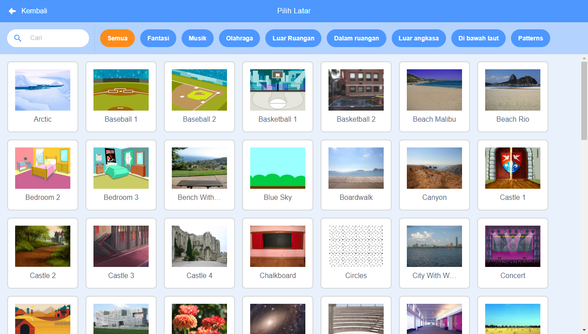

Click on **Choose a Backdrop** in the bottom right-hand corner of the screen to open the Backdrop Library:

You can search for a backdrop, or browse for one by category. Click on a backdrop to add it to your project.

