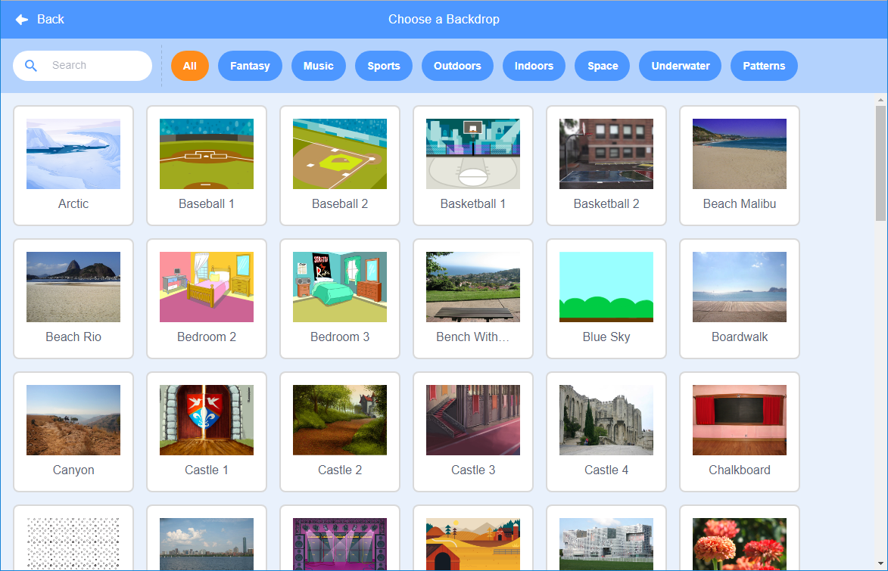

ಬ್ಯಾಕ್‌ಡ್ರಾಪ್ ಲೈಬ್ರರಿಯನ್ನು ತೆರೆಯಲು ಪರದೆಯ ಕೆಳಗಿನ ಬಲ ಮೂಲೆಯಲ್ಲಿ **Choose a Backdrop** ಅನ್ನು ಕ್ಲಿಕ್ ಮಾಡಿ:

ನೀವು ಬ್ಯಾಕ್‌ಡ್ರಾಪ್‌ಗಾಗಿ ಹುಡುಕಬಹುದು, ಅಥವಾ ಒಂದೊಂದು ವರ್ಗವನ್ನು ಬ್ರೌಸ್ ಮಾಡಬಹುದು. ನಿಮ್ಮ ಪ್ರಾಜೆಕ್ಟ್ ಗೆ ಸೇರಿಸಲು ಬ್ಯಾಕ್‌ಡ್ರಾಪ್ ಮೇಲೆ ಕ್ಲಿಕ್ ಮಾಡಿ.

