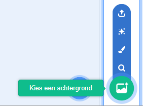
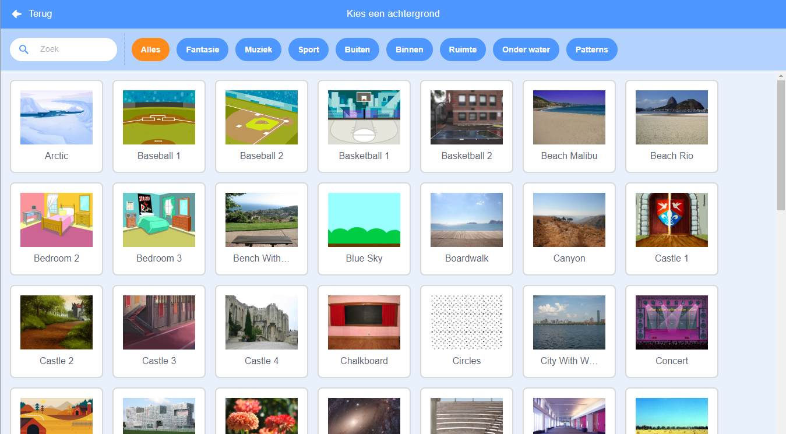

Klik op **Kies een achtergrond** in de rechteronderhoek van het scherm om de Achtergrond-bibliotheek te openen:

Je kunt naar een achtergrond zoeken of naar één op thema zoeken. Klik op een achtergrond om deze te selecteren.

