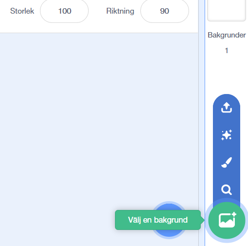
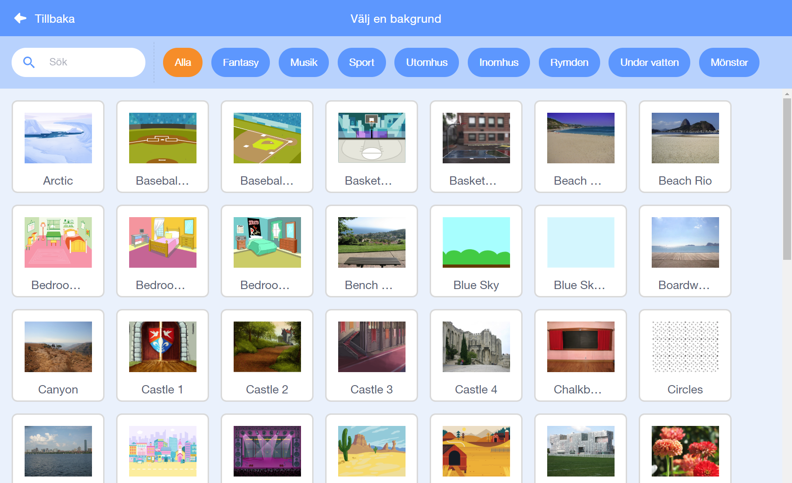

Klicka på **Välj en bakgrund** i det nedre högra hörnet av skärmen för att öppna Bakgrundsbiblioteket:

Du kan söka efter en bakgrund eller hitta en under en av kategorierna. Klicka på en bakgrund för att lägga till den i ditt projekt.

