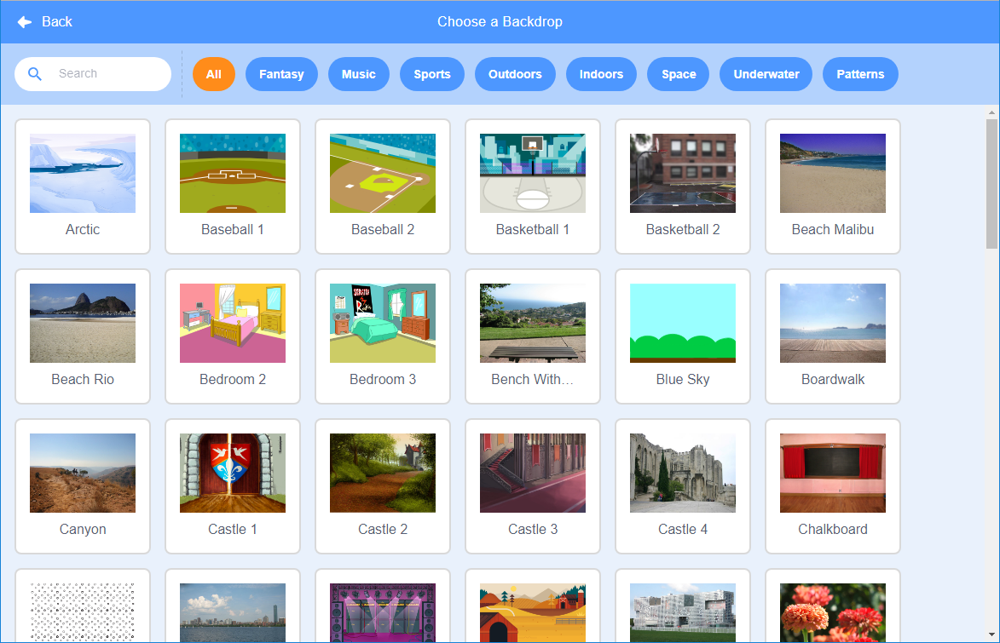

+ கீழ் வலதுபுறத்தில் உள்ள **Choose a Backdrop** என்பதைக் கிளிக் செய்க.

+ நீங்கள் ஒரு பின்னணியைத் தேடலாம் அல்லது வகை அல்லது கருப்பொருளின்(தீம்-theme) அடிப்படையில் ஒரு பின்னணியை உலாவிக் கண்டறியலாம். ஒரு பின்னணியைத் தேர்ந்தெடுக்க அதன் மீது கிளிக் செய்யவும்.

